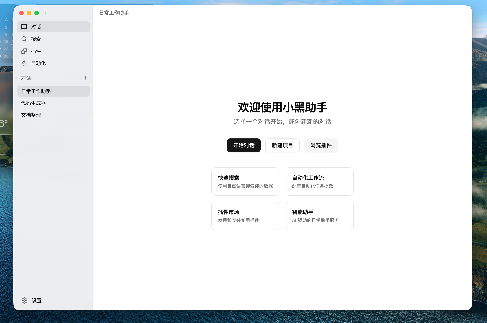
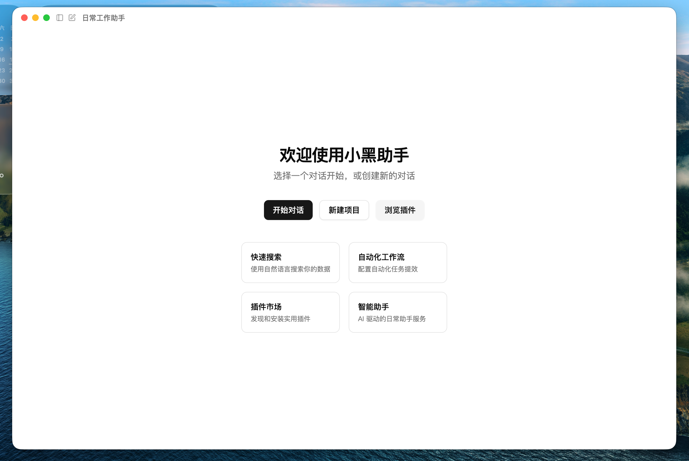

<div align="center">
  
</div>

[English](./README_EN.md) | 中文

# Electron 桌面应用脚手架

一个可复用的 Electron 桌面端 UI 脚手架模板。当你需要快速搭建一个风格类似的桌面应用时，直接克隆本仓库即可跳过繁琐的基础框架搭建工作。

> **UI 设计说明**：本项目界面设计参考了 [OpenAI Codex CLI](https://github.com/openai/codex) 的 UI 风格，在此基础上进行了适配和扩展。

**作者**：李召伟 Leo

## 界面预览





## 开箱即用的能力

| 能力 | 说明 |
|------|------|
| 无边框透明窗口 | Frameless window + macOS 毛玻璃效果 (`vibrancy`) |
| 左侧菜单栏 | 可折叠 Sidebar，支持展开/收起动画 |
| 系统托盘 | macOS Dock 图标 + 托盘菜单；Windows 任务栏图标 + 托盘 |
| 统一图标系统 | 多分辨率 ICO (Windows) / ICNS (macOS) / PNG 自动适配 |
| 窗口控制 | 最小化 / 最大化 / 关闭，macOS Traffic Lights 适配 |
| 拖拽区域 | 顶部区域原生拖拽移动窗口 |
| 跨平台布局 | 自动检测 macOS / Windows，适配不同窗口控件位置 |

## 技术栈

- **Electron 41** — 桌面应用框架
- **Vue 3** + **TypeScript** — 前端框架
- **Vite 8** — 构建工具
- **shadcn-vue** — UI 组件库（Reka UI + Tailwind CSS v4）
- **lucide-vue-next** — 图标库

## 项目结构

```
desktop-app/
├── electron/
│   ├── main.ts           # 主进程：窗口创建、托盘、IPC 通信
│   └── preload.cjs       # 预加载脚本（必须是 CommonJS）
├── src/
│   ├── components/
│   │   └── Sidebar.vue   # 侧边栏组件（含折叠逻辑）
│   ├── lib/              # 工具函数
│   ├── App.vue           # 主界面（左右布局）
│   └── style.css         # 全局样式
├── vite.config.ts        # Vite + Electron 插件配置
└── package.json
```

## 快速开始

```bash
cd desktop-app
cnpm install
cnpm run dev
```

## 构建

```bash
cd desktop-app
cnpm run build
```

## 使用方式

1. 克隆本仓库到本地：
   ```bash
   git clone <repository-url> your-new-project
   cd your-new-project
   ```
2. 修改 `package.json` 中的应用名称和描述
3. 替换 `electron/icons/` 下的图标文件
4. 在 `src/` 下开发你的业务逻辑，侧边栏和布局框架已就绪

